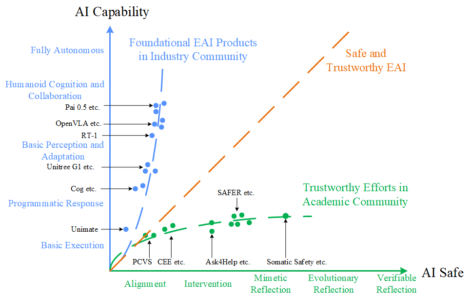
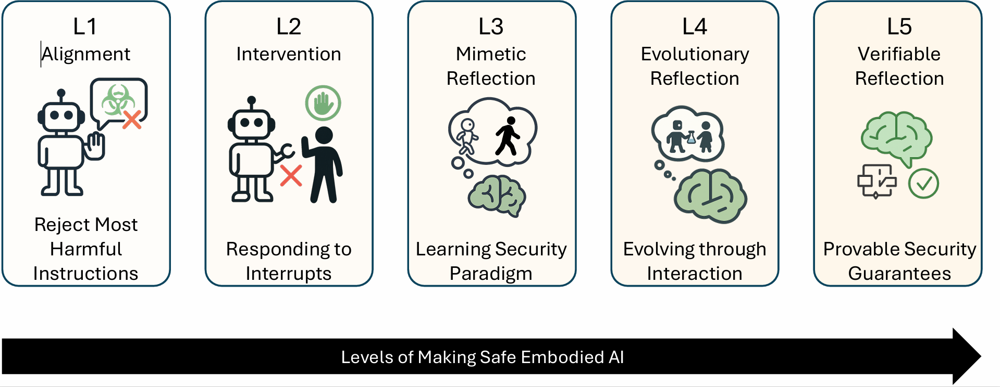

<div align="center">

# Towards Safe and Trustworthy Embodied AI: Foundations, Status, and Prospects

</div>

<div align="center">

Xin Tan<sup>&ast;</sup> [🔗](https://tanxincs.github.io/ "Homepage") · 
Bangwei Liu<sup>&ast;</sup> · 
Yicheng Bao · Qijian Tian · Zhenkun Gao · Xiongbin Wu ·  
Zhihao Luo · Sen Wang · Yuqi Zhang · Xuhong Wang<sup>&dagger;</sup> · 
Chaochao Lu<sup>&dagger;</sup> [🔗](https://causallu.com/ "Homepage") · 
Bowen Zhou<sup>&dagger;</sup> [🔗](https://scholar.google.com/citations?user=h3Nsz6YAAAAJ "Scholar")
</div>


<div align="center">

**上海人工智能实验室 / Shanghai Artificial Intelligence Laboratory [🔗](https://www.shlab.org.cn/)**  
**华东师范大学 / East China Normal University [🔗](https://www.ecnu.edu.cn/)**  

</div>


---

<div align="center">
  <div style="max-width:980px;padding:24px 28px;border:1.6px solid rgba(255,255,255,.6);
              border-radius:14px;box-shadow:inset 0 0 0 3px rgba(255,255,255,.08);
              ">
    <h3 style="text-align:center;margin:0 0 16px 0;">Abstract</h3>
    <p style="margin:0;font-style:italic;line-height:1.9;
              text-align:justify;text-justify:inter-word;">
      The increasing autonomy and physical capability of Embodied Artificial Intelligence (EAI) introduce critical
      challenges to safety and trustworthiness. Unlike purely digital AI, failures in perception, planning, or
      interaction can lead to direct physical harm, property damage, or the violation of human safety and social norms.
      However, current EAI foundation models disregard the risks of misalignment between the model capabilities and
      the safety and trustworthiness competencies. Some works attempt to address these issues, however, they lack a
      unified framework capable of balancing the developmental trajectories between safety and capability. In this
      paper, we first comprehensively define a new term <em>safe and trustworthy EAI</em> by establishing an L1–L5 levels
      framework and proposing ten core principles of trustworthiness and safety. To unify fragmented research efforts,
      we propose a novel, agent-centric framework that analyzes risks across the four operational stages of an EAI
      system. We systematically review state-of-the-art but fragmented solutions, benchmarks, and evaluation metrics,
      identifying key gaps and challenges. Finally, we identify the need for a paradigm shift away from optimizing
      isolated components towards a holistic, cybernetic approach. We argue that future progress hinges on engineering
      the closed-loop system of the agent (Self), its environment (World), and their dynamic coupling (Interaction),
      paving the way for the next generation of truly safe and trustworthy EAI.
    </p>
  </div>
</div>


<div style="height:32px;"></div>


<div style="text-align:center;">
  
  <p><strong>Figure 1.</strong> Capability–Safety divergence in the Embodied AI landscape</p>
</div>


<div align="center">
  <h3>Research Motivation</h3>
  <p>
    While embodied AI (EAI) products are rapidly improving in capability, they often lack reliable
    safety mechanisms. In contrast, academic safety research remains fragmented and lags behind in
    capability. This divergence has raised significant concerns about the trustworthiness of physical
    AI systems.To address this gap, we propose a unified research framework that integrates capability advancement
    and trustworthy safety, paving the way for the development of safe and aligned embodied agents.
  </p>
    
</div>


<div style="text-align:center;margin-bottom:14px;">
  <h3 style="margin:0 0 6px 0;">The Five Levels of “Make Safe EAI”</h3>
  <div style="opacity:.9;">
    We chart the progression from <strong>Resistance (L1–L2)</strong> to <strong>Resilience (L3–L5)</strong>,
    moving from refusal and oversight to adaptive learning and verifiable guarantees.
  </div>
</div>


<div style="text-align:center;margin:0 0 24px 0;">
  
  <div style="margin-top:8px;"><strong>Figure 2.</strong> From Resistance (L1–L2) to Resilience (L3–L5)</div>
</div>


<div style="display:flex;justify-content:center;gap:18px;margin:0 auto 18px auto;flex-wrap:nowrap;max-width:1200px;">
  <div style="width:360px;border:1px solid rgba(255,255,255,.22);border-radius:14px;padding:16px 20px;background:rgba(255,255,255,.04);box-shadow:0 2px 6px rgba(0,0,0,.12);">
    <div style="font-weight:700;margin-bottom:8px;">L1 — Alignment <span style="opacity:.75;font-weight:400;">(Foundational Resistance)</span></div>
    <ul style="margin:0;padding-left:18px;">
      <li><b>Goal:</b> Refuse harmful instructions; follow basic safety norms.</li>
      <li><b>How:</b> Instruction tuning, RLHF, safety filters, red-teaming data.</li>
      <li><b>Limit:</b> Correlation-based; vulnerable to jailbreaks and shifts.</li>
    </ul>
  </div>

  <div style="width:360px;border:1px solid rgba(255,255,255,.22);border-radius:14px;padding:16px 20px;background:rgba(255,255,255,.04);box-shadow:0 2px 6px rgba(0,0,0,.12);">
    <div style="font-weight:700;margin-bottom:8px;">L2 — Intervention <span style="opacity:.75;font-weight:400;">(Oversight-based Resistance)</span></div>
    <ul style="margin:0;padding-left:18px;">
      <li><b>Goal:</b> Let humans halt/redirect <em>before</em> risky actions.</li>
      <li><b>How:</b> Interrupt channels, intent/plan display, trajectory visualization.</li>
      <li><b>Limit:</b> Needs constant oversight; weak scalability to high autonomy.</li>
    </ul>
  </div>
</div>


<div style="display:flex;justify-content:center;gap:18px;margin:0 auto;flex-wrap:nowrap;max-width:1200px;">
  <div style="width:360px;border:1px solid rgba(255,255,255,.22);border-radius:14px;padding:16px 20px;background:rgba(255,255,255,.04);box-shadow:0 2px 6px rgba(0,0,0,.12);">
    <div style="font-weight:700;margin-bottom:8px;">L3 — Mimetic Reflection <span style="opacity:.75;font-weight:400;">(Foundational Resilience)</span></div>
    <ul style="margin:0;padding-left:18px;">
      <li><b>Goal:</b> Internalize validated safe behaviors.</li>
      <li><b>How:</b> Imitation learning, behavior cloning, curated safety playbooks.</li>
      <li><b>Limit:</b> Limited generalization to novel tasks and combinations.</li>
    </ul>
  </div>

  <div style="width:360px;border:1px solid rgba(255,255,255,.22);border-radius:14px;padding:16px 20px;background:rgba(255,255,255,.04);box-shadow:0 2px 6px rgba(0,0,0,.12);">
    <div style="font-weight:700;margin-bottom:8px;">L4 — Evolutionary Reflection <span style="opacity:.75;font-weight:400;">(Adaptive Resilience)</span></div>
    <ul style="margin:0;padding-left:18px;">
      <li><b>Goal:</b> Continual self-improvement; proactive patching.</li>
      <li><b>How:</b> Continual learning, self red-teaming, safety-aware exploration.</li>
      <li><b>Limit:</b> Empirical assurance only — no prior formal guarantees.</li>
    </ul>
  </div>

  <div style="width:360px;border:1px solid rgba(255,255,255,.22);border-radius:14px;padding:16px 20px;background:rgba(255,255,255,.04);box-shadow:0 2px 6px rgba(0,0,0,.12);">
    <div style="font-weight:700;margin-bottom:8px;">L5 — Verifiable Reflection <span style="opacity:.75;font-weight:400;">(Guaranteed Resilience)</span></div>
    <ul style="margin:0;padding-left:18px;">
      <li><b>Goal:</b> Provable safety/stability of closed-loop behavior.</li>
      <li><b>How:</b> Reachability/invariance analysis, control-theoretic synthesis, neuro-symbolic proofs.</li>
      <li><b>Limit:</b> Model/compute-intensive; engineering maturity evolving.</li>
    </ul>
  </div>
</div>

# References

- [**A Model-Agnostic Approach for Semantically Driven Disambiguation in Human-Robot Interaction**](https://arxiv.org/abs/2409.17004) — _Fethiye Irmak Dogan_ (2025.04) [🔗](https://arxiv.org/abs/2409.17004)
  - Tags: `Accuracy` `Instruction Understanding`
- [**AGENTSAFE: Benchmarking the Safety of Embodied Agents on Hazardous Instructions**](https://arxiv.org/abs/2506.14697) — _Aishan Liu_ (2025.06) [🔗](https://arxiv.org/abs/2506.14697)
  - Tags: `Attack Resistance` `Instruction Understanding`
- [**Advancing Embodied Agent Security: From Safety Benchmarks to Input Moderation**](https://arxiv.org/abs/2504.15699) — _Ning Wang_ (2025.04) [🔗](https://arxiv.org/abs/2504.15699)
  - Tags: `Attack Resistance` `Instruction Understanding`
- [**Adversarial Attacks on Robotic Vision Language Action Models**](https://arxiv.org/abs/2506.03350) — _Eliot Krzysztof Jones_ (2025.06) [🔗](https://arxiv.org/abs/2506.03350)
  - Tags: `Attack Resistance` `Instruction Understanding`
- [**Adversarial Training for Multimodal Large Language Models against Jailbreak Attacks**](https://arxiv.org/abs/2503.04833) — _Liming Lu_ (2025.03) [🔗](https://arxiv.org/abs/2503.04833)
  - Tags: `Attack Resistance` `Instruction Understanding`
- [**BadNAVer: Exploring Jailbreak Attacks On Vision-and-Language Navigation**](https://arxiv.org/abs/2505.12443) — _Wenqi Lyu_ (2025.05) [🔗](https://arxiv.org/abs/2505.12443)
  - Tags: `Attack Resistance` `Instruction Understanding`
- [**Concept Enhancement Engineering: A Lightweight and Efficient Robust Defense Against Jailbreak Attacks in Embodied AI**](https://arxiv.org/abs/2504.13201) — _Jirui Yang; Zheyu Lin_ (2025.04) [🔗](https://arxiv.org/abs/2504.13201)
  - Tags: `Attack Resistance` `Instruction Understanding`
- [**DoRO: Disambiguation of Referred Object for Embodied Agents**](https://ieeexplore.ieee.org/abstract/document/9846930) — _Pradip Pramanick_ (22.1) [🔗](https://ieeexplore.ieee.org/abstract/document/9846930)
  - Tags: `Accuracy` `Instruction Understanding`
- [**Embodied Instruction Following in Unknown Environments**](https://www.arxiv.org/pdf/2406.11818) — (2025.07) [🔗](https://www.arxiv.org/pdf/2406.11818)
  - Tags: `Reliability` `Instruction Understanding`
- [**Embodied Multi-Agent Task Planning from Ambiguous Instruction**](https://web.archive.org/web/20220704170254id_/http://www.roboticsproceedings.org/rss18/p032.pdf) — _Xinzhu Liu_ (2022.06) [🔗](https://web.archive.org/web/20220704170254id_/http://www.roboticsproceedings.org/rss18/p032.pdf)
  - Tags: `Accuracy` `Instruction Understanding`
- [**Grounding Multimodal LLMs to Embodied Agents that Ask for Help with Reinforcement Learning**](https://arxiv.org/abs/2504.00907) — _Ram Ramrakhya_ (2025.04) [🔗](https://arxiv.org/abs/2504.00907)
  - Tags: `Accuracy` `Instruction Understanding`
- [**Improving Grounded Natural Language Understanding through Human-Robot Dialog**](https://ieeexplore.ieee.org/abstract/document/8794287) — _Jesse Thomason_ (2019.05) [🔗](https://ieeexplore.ieee.org/abstract/document/8794287)
  - Tags: `Accuracy` `Instruction Understanding`
- [**Inner Monologue: Embodied Reasoning through Planning with Language Models**](https://arxiv.org/abs/2207.05608) — (2022.07) [🔗](https://arxiv.org/abs/2207.05608)
  - Tags: `Accuracy` `Instruction Understanding`
- [**Integrating Disambiguation and User Preferences into Large Language Models for Robot Motion Planning**](https://arxiv.org/abs/2404.14547) — _Mohammed Abugurain_ (2024.04) [🔗](https://arxiv.org/abs/2404.14547)
  - Tags: `Accuracy` `Instruction Understanding`
- [**Jailbreaking LLM-Controlled Robots**](https://arxiv.org/abs/2410.13691) — _Alexander Robey_ (24.1) [🔗](https://arxiv.org/abs/2410.13691)
  - Tags: `Attack Resistance` `Instruction Understanding`
- [**LACMA: Language-Aligning Contrastive Learning with Meta-Actions for Embodied Instruction Following**](https://arxiv.org/abs/2310.12344) — (23.1) [🔗](https://arxiv.org/abs/2310.12344)
  - Tags: `Reliability` `Instruction Understanding`
- [**LLM-Driven Robots Risk Enacting Discrimination, Violence, and Unlawful Actions**](https://arxiv.org/abs/2406.08824) — (2024.06) [🔗](https://arxiv.org/abs/2406.08824)
  - Tags: `Value Alignment` `Instruction Understanding`
- [**MM-SafetyBench: A Benchmark for Safety Evaluation of Multimodal Large Language Models**](https://arxiv.org/abs/2311.17600) — _Xin Liu_ (2023.11) [🔗](https://arxiv.org/abs/2311.17600)
  - Tags: `Attack Resistance` `Instruction Understanding`
- [**NarraGuide: an LLM-based Narrative Mobile Robot for Remote Place Exploration**](https://www.arxiv.org/abs/2508.01235) — (2025.08) [🔗](https://www.arxiv.org/abs/2508.01235)
  - Tags: `Accuracy` `Instruction Understanding`
- [**Navigation as Attackers Wish? Towards Building Robust Embodied Agents under Federated Learning**](https://arxiv.org/abs/2211.14769) — _Yunchao Zhang_ (2022.11) [🔗](https://arxiv.org/abs/2211.14769)
  - Tags: `Accuracy` `Instruction Understanding`
- [**Open-Ended Instructable Embodied Agents with Memory-Augmented Large Language Models**](https://arxiv.org/abs/2310.15127) — (23.1) [🔗](https://arxiv.org/abs/2310.15127)
  - Tags: `Accuracy` `Instruction Understanding`
- [**POEX: Understanding and Mitigating Policy Executable Jailbreak Attacks against Embodied AI**](https://arxiv.org/abs/2412.16633) — _Xuancun Lu_ (2024.12) [🔗](https://arxiv.org/abs/2412.16633)
  - Tags: `Attack Resistance` `Instruction Understanding`
- [**Plug in the Safety Chip: Enforcing Constraints for LLM-driven Robot Agents**](https://arxiv.org/abs/2309.09919) — (2023.09) [🔗](https://arxiv.org/abs/2309.09919)
  - Tags: `Abuse Prevention` `Instruction Understanding`
- [**Security Considerations in AI-Robotics: A Survey of Current Methods, Challenges, and Opportunities**](https://arxiv.org/abs/2310.08565) — (23.1) [🔗](https://arxiv.org/abs/2310.08565)
  - Tags: `Privacy Protection` `Instruction Understanding`
- [**Semantic Skill Grounding for Embodied Instruction-Following in Cross-Domain Environments**](https://arxiv.org/abs/2408.01024) — (2024.08) [🔗](https://arxiv.org/abs/2408.01024)
  - Tags: `Reliability` `Instruction Understanding`
- [**ThinkBot: Embodied Instruction Following with Thought Chain Reasoning**](https://arxiv.org/abs/2312.07062) — (2023.12) [🔗](https://arxiv.org/abs/2312.07062)
  - Tags: `Accuracy` `Instruction Understanding`
- [**Towards Robust Multimodal Large Language Models Against Jailbreak Attacks**](https://arxiv.org/abs/2502.00653) — _Ziyi Yin_ (2025.02) [🔗](https://arxiv.org/abs/2502.00653)
  - Tags: `Attack Resistance` `Instruction Understanding`
- [**Verifiably Following Complex Robot Instructions with Foundation Models**](https://arxiv.org/abs/2402.11498) — (2024.02) [🔗](https://arxiv.org/abs/2402.11498)
  - Tags: `Reliability` `Instruction Understanding`
- [**tagE: Enabling an Embodied Agent to Understand Human Instructions**](https://arxiv.org/abs/2310.15605) — (23.1) [🔗](https://arxiv.org/abs/2310.15605)
  - Tags: `Accuracy` `Instruction Understanding`
- [**A Survey on Adversarial Robustness of LiDAR-based Machine Learning Perception in Autonomous Vehicles**](https://arxiv.org/pdf/2411.13778v1) — _Junae Kim_ (2024.11) [🔗](https://arxiv.org/pdf/2411.13778v1)
  - Tags: `Attack Resistance` `Abuse Prevention` `Environment Perception`
- [**Active SLAM With Dynamic Viewpoint Optimization for Robust Visual Navigation**](https://ieeexplore.ieee.org/abstract/document/11037221) — _Peng Li_ (2025.06) [🔗](https://ieeexplore.ieee.org/abstract/document/11037221)
  - Tags: `Accuracy` `Reliability` `Environment Perception`
- [**Adversarial Attacks and Detection in Visual Place Recognition for Safer Robot Navigation**](https://arxiv.org/pdf/2506.15988) — _Connor Malone_ (2025.01) [🔗](https://arxiv.org/pdf/2506.15988)
  - Tags: `Attack Resistance` `Abuse Prevention` `Environment Perception`
- [**An Enactive Approach to Value Alignment in Artificial Intelligence: A Matter of Relevance**](https://philpapers.org/archive/CANAEA-5.pdf) — (2025.11) [🔗](https://philpapers.org/archive/CANAEA-5.pdf)
  - Tags: `Value Alignment` `Environment Perception`
- [**AuditMAI: Towards An Infrastructure for Continuous AI Auditing**](https://arxiv.org/abs/2406.14243) — (2024.06) [🔗](https://arxiv.org/abs/2406.14243)
  - Tags: `Auditability` `Environment Perception`
- [**BadDepth: Backdoor Attacks Against Monocular Depth Estimation in the Physical World**](https://arxiv.org/pdf/2505.16154) — _Ji Guo_ (2025.05) [🔗](https://arxiv.org/pdf/2505.16154)
  - Tags: `Attack Resistance` `Abuse Prevention` `Environment Perception`
- [**E2CL: exploration-based error correction learning for embodied agents**](https://arxiv.org/abs/2409.03256) — (2024.09) [🔗](https://arxiv.org/abs/2409.03256)
  - Tags: `Explainability` `Environment Perception`
- [**Embodied Active Defense: Leveraging Recurrent Feedback to Counter Adversarial Patches**](https://arxiv.org/abs/2404.00540) — (2024.03) [🔗](https://arxiv.org/abs/2404.00540)
  - Tags: `Attack Resistance` `Abuse Prevention` `Environment Perception`
- [**Embodied Laser Attack:Leveraging Scene Priors to Achieve Agent-based Robust Non-contact Attacks**](https://arxiv.org/abs/2312.09554) — (2024.07) [🔗](https://arxiv.org/abs/2312.09554)
  - Tags: `Attack Resistance` `Abuse Prevention` `Environment Perception`
- [**Embodied Uncertainty-Aware Object Segmentation**](https://ieeexplore.ieee.org/abstract/document/10801562) — _fang2024embodied_ (24.1) [🔗](https://ieeexplore.ieee.org/abstract/document/10801562)
  - Tags: `Accuracy` `Environment Perception`
- [**Embodied active domain adaptation for semantic segmentation via informative path planning**](https://ieeexplore.ieee.org/abstract/document/9816133) — _René Zurbrügg_ (22.1) [🔗](https://ieeexplore.ieee.org/abstract/document/9816133)
  - Tags: `Accuracy` `Environment Perception`
- [**Embodied videoagent: Persistent memory from egocentric videos and embodied sensors enables dynamic scene understanding**](https://arxiv.org/abs/2501.00358) — (2025.01) [🔗](https://arxiv.org/abs/2501.00358)
  - Tags: `Explainability` `Environment Perception`
- [**Embodied visual active learning for semantic segmentation**](https://ojs.aaai.org/index.php/AAAI/article/view/16338) — _David Nilsson_ (2021.12) [🔗](https://ojs.aaai.org/index.php/AAAI/article/view/16338)
  - Tags: `Accuracy` `Environment Perception`
- [**Embodiedgpt: Vision-language pre-training via embodied chain of thought**](https://proceedings.neurips.cc/paper_files/paper/2023/file/4ec43957eda1126ad4887995d05fae3b-Paper-Conference.pdf) — _Yao Mu_ (2023.05) [🔗](https://proceedings.neurips.cc/paper_files/paper/2023/file/4ec43957eda1126ad4887995d05fae3b-Paper-Conference.pdf)
  - Tags: `Accuracy` `Environment Perception`
- [**Embodiedscan: A holistic multi-modal 3d perception suite towards embodied ai**](https://openaccess.thecvf.com/content/CVPR2024/html/Wang_EmbodiedScan_A_Holistic_Multi-Modal_3D_Perception_Suite_Towards_Embodied_AI_CVPR_2024_paper.html) — _Tai Wang_ (2024.03) [🔗](https://openaccess.thecvf.com/content/CVPR2024/html/Wang_EmbodiedScan_A_Holistic_Multi-Modal_3D_Perception_Suite_Towards_Embodied_AI_CVPR_2024_paper.html)
  - Tags: `Accuracy` `Environment Perception`
- [**Enhancing embodied object detection through language-image pre-training and implicit object memory**](https://arxiv.org/pdf/2402.03721) — _Nicolas Harvey Chapman_ (2024.02) [🔗](https://arxiv.org/pdf/2402.03721)
  - Tags: `Accuracy` `Environment Perception`
- [**From Strangers to Assistants: Fast Desire Alignment for Embodied Agent-User Adaptation**](https://arxiv.org/abs/2505.22503) — (2025.05) [🔗](https://arxiv.org/abs/2505.22503)
  - Tags: `Value Alignment` `Environment Perception`
- [**Good time to ask: A learning framework for asking for help in embodied visual navigation**](https://arxiv.org/abs/2206.10606) — (2023.06) [🔗](https://arxiv.org/abs/2206.10606)
  - Tags: `Explainability` `Environment Perception`
- [**Improved Semantic Segmentation from Ultra-Low-Resolution RGB Images Applied to Privacy-Preserving Object-Goal Navigation**](https://arxiv.org/abs/2507.16034) — (2025.07) [🔗](https://arxiv.org/abs/2507.16034)
  - Tags: `Privacy Protection` `Environment Perception`
- [**Interactive task learning via embodied corrective feedback**](https://link.springer.com/article/10.1007/s10458-020-09481-8) — (2020.09) [🔗](https://link.springer.com/article/10.1007/s10458-020-09481-8)
  - Tags: `Explainability` `Environment Perception`
- [**Interactron: Embodied adaptive object detection**](https://openaccess.thecvf.com/content/CVPR2022/papers/Kotar_Interactron_Embodied_Adaptive_Object_Detection_CVPR_2022_paper.pdf) — _Klemen Kotar_ (2022.03) [🔗](https://openaccess.thecvf.com/content/CVPR2022/papers/Kotar_Interactron_Embodied_Adaptive_Object_Detection_CVPR_2022_paper.pdf)
  - Tags: `Accuracy` `Environment Perception`
- [**Is the robot spying on me? a study on perceived privacy in telepresence scenarios in a care setting with mobile and humanoid robots**](https://link.springer.com/article/10.1007/s12369-024-01153-x) — (2024.08) [🔗](https://link.springer.com/article/10.1007/s12369-024-01153-x)
  - Tags: `Privacy Protection` `Environment Perception`
- [**Learn how to see: collaborative embodied learning for object detection and camera adjusting**](https://ojs.aaai.org/index.php/AAAI/article/view/28281) — _Lingdong Shen_ (2024.03) [🔗](https://ojs.aaai.org/index.php/AAAI/article/view/28281)
  - Tags: `Accuracy` `Environment Perception`
- [**Learning robust perceptive locomotion for quadrupedal robots in the wild**](https://arxiv.org/abs/2201.08117) — _TAKAHIRO MIKI_ (2022.01) [🔗](https://arxiv.org/abs/2201.08117)
  - Tags: `Accuracy` `Reliability` `Environment Perception`
- [**Learning to Walk by Steering: Perceptive Quadrupedal Locomotion in Dynamic Environments**](https://arxiv.org/abs/2209.09233) — _Mingyo Seo_ (2022.09) [🔗](https://arxiv.org/abs/2209.09233)
  - Tags: `Accuracy` `Reliability` `Environment Perception`
- [**Legged locomotion in challenging terrains using egocentric vision**](https://proceedings.mlr.press/v205/agarwal23a.html) — _Ananye Agarwal_ (2022.11) [🔗](https://proceedings.mlr.press/v205/agarwal23a.html)
  - Tags: `Accuracy` `Reliability` `Environment Perception`
- [**Monitoring and Diagnosability of Perception Systems**](https://arxiv.org/abs/2005.11816) — (2020.11) [🔗](https://arxiv.org/abs/2005.11816)
  - Tags: `Auditability` `Environment Perception`
- [**Move to see better: Self-improving embodied object detection**](https://www.bmvc2021-virtualconference.com/assets/papers/0615.pdf) — _Zhaoyuan Fang_ (2020.12) [🔗](https://www.bmvc2021-virtualconference.com/assets/papers/0615.pdf)
  - Tags: `Accuracy` `Environment Perception`
- [**Obstacle-Aware Quadrupedal Locomotion With Resilient Multi-Modal Reinforcement Learning**](https://arxiv.org/abs/2409.19709) — _I Made Aswin Nahrendra_ (2024.09) [🔗](https://arxiv.org/abs/2409.19709)
  - Tags: `Accuracy` `Reliability` `Environment Perception`
- [**On the Sensory Commutativity of Action Sequences for Embodied Agents**](https://arxiv.org/abs/2002.05630) — (2021.01) [🔗](https://arxiv.org/abs/2002.05630)
  - Tags: `Value Alignment` `Environment Perception`
- [**Openvla: An open-source vision-language-action model**](https://arxiv.org/abs/2406.09246) — _Moo Jin Kim_ (2024.06) [🔗](https://arxiv.org/abs/2406.09246)
  - Tags: `Accuracy` `Environment Perception`
- [**Palm-e: An embodied multimodal language model**](https://dl.acm.org/doi/abs/10.5555/3618408.3618748) — _Danny Driess_ (2023.07) [🔗](https://dl.acm.org/doi/abs/10.5555/3618408.3618748)
  - Tags: `Accuracy` `Environment Perception`
- [**Perception Matters: Enhancing Embodied AI with Uncertainty-Aware Semantic Segmentation**](https://arxiv.org/pdf/2408.02297) — _Sai Prasanna_ (2024.08) [🔗](https://arxiv.org/pdf/2408.02297)
  - Tags: `Accuracy` `Environment Perception`
- [**Privacy Risks of Robot Vision: A User Study on Image Modalities and Resolution**](https://arxiv.org/abs/2505.07766) — (2025.05) [🔗](https://arxiv.org/abs/2505.07766)
  - Tags: `Privacy Protection` `Environment Perception`
- [**Privacy beyond Data: Assessment and Mitigation of Privacy Risks in Robotic Technology for Elderly Care**](https://dl.acm.org/doi/10.1145/3689216) — (2024.11) [🔗](https://dl.acm.org/doi/10.1145/3689216)
  - Tags: `Privacy Protection` `Environment Perception`
- [**Privacy-preserving robot vision with anonymized faces by extreme low resolution**](https://ieeexplore.ieee.org/document/8967681) — (2019.11) [🔗](https://ieeexplore.ieee.org/document/8967681)
  - Tags: `Privacy Protection` `Environment Perception`
- [**RT-2: Vision-Language-Action Models Transfer Web Knowledge to Robotic Control**](https://proceedings.mlr.press/v229/zitkovich23a.html) — (2023.07) [🔗](https://proceedings.mlr.press/v229/zitkovich23a.html)
  - Tags: `Accuracy` `Environment Perception`
- [**Random Spoofing Attack against Scan Matching Algorithm SLAM (Long)**](https://www.ndss-symposium.org/ndss-paper/auto-draft-476/) — (2024.02) [🔗](https://www.ndss-symposium.org/ndss-paper/auto-draft-476/)
  - Tags: `Attack Resistance` `Abuse Prevention` `Environment Perception`
- [**Real-time privacy preservation for robot visual perception**](https://arxiv.org/abs/2505.05519) — (2025.05) [🔗](https://arxiv.org/abs/2505.05519)
  - Tags: `Privacy Protection` `Environment Perception`
- [**Resilient Legged Local Navigation: Learning to Traverse with Compromised Perception End-to-End**](https://ieeexplore.ieee.org/abstract/document/10611254) — _Jin Jin_ (23.1) [🔗](https://ieeexplore.ieee.org/abstract/document/10611254)
  - Tags: `Accuracy` `Reliability` `Environment Perception`
- [**Robot Manipulation Based on Embodied Visual Perception: A Survey**](https://ietresearch.onlinelibrary.wiley.com/doi/full/10.1049/cit2.70022) — _Sicheng Wang_ (2025.06) [🔗](https://ietresearch.onlinelibrary.wiley.com/doi/full/10.1049/cit2.70022)
  - Tags: `Accuracy` `Environment Perception`
- [**Robustnav: Towards benchmarking robustness in embodied navigation**](https://openaccess.thecvf.com/content/ICCV2021/html/Chattopadhyay_RobustNav_Towards_Benchmarking_Robustness_in_Embodied_Navigation_ICCV_2021_paper.html) — _Prithvijit Chattopadhyay_ (2021.06) [🔗](https://openaccess.thecvf.com/content/ICCV2021/html/Chattopadhyay_RobustNav_Towards_Benchmarking_Robustness_in_Embodied_Navigation_ICCV_2021_paper.html)
  - Tags: `Accuracy` `Reliability` `Environment Perception`
- [**Robustness of embodied point navigation agents**](https://link.springer.com/chapter/10.1007/978-3-031-25075-0_15) — _Frano Rajiˇc_ (2023.02) [🔗](https://link.springer.com/chapter/10.1007/978-3-031-25075-0_15)
  - Tags: `Accuracy` `Reliability` `Environment Perception`
- [**SLAMSpoof: Practical LiDAR Spoofing Attacks on Localization Systems Guided by Scan Matching Vulnerability Analysis**](https://arxiv.org/html/2502.13641v1) — _Rokuto Nagata_ (2025.02) [🔗](https://arxiv.org/html/2502.13641v1)
  - Tags: `Attack Resistance` `Abuse Prevention` `Environment Perception`
- [**Safety Assessment for Autonomous Systems' Perception Capabilities**](https://arxiv.org/abs/2208.08237) — (2022.08) [🔗](https://arxiv.org/abs/2208.08237)
  - Tags: `Auditability` `Environment Perception`
- [**Self-Explainable Affordance Learning with 
Embodied Caption**](https://arxiv.org/abs/2404.05603) — _Zhipeng Zhang_ (2024.04) [🔗](https://arxiv.org/abs/2404.05603)
  - Tags: `Explainability` `Environment Perception`
- [**SoK: Rethinking Sensor Spoofing Attacks against Robotic Vehicles from a Systematic View**](https://arxiv.org/abs/2205.04662) — (2023.07) [🔗](https://arxiv.org/abs/2205.04662)
  - Tags: `Attack Resistance` `Abuse Prevention` `Environment Perception`
- [**Towards Embodied Agent Intent Explanation in Human-Robot Collaboration: ACT Error Analysis and Solution Conceptualization**](https://openreview.net/forum?id=gPqkW8V6Je) — (2025.05) [🔗](https://openreview.net/forum?id=gPqkW8V6Je)
  - Tags: `Explainability` `Environment Perception`
- [**Towards Robust and Secure Embodied AI: A Survey on Vulnerabilities and Attacks**](https://arxiv.org/pdf/2502.13175) — _WENPENG XING_ (2025.02) [🔗](https://arxiv.org/pdf/2502.13175)
  - Tags: `Attack Resistance` `Abuse Prevention` `Environment Perception`
- [**Viewinfer3d: 3d visual grounding based on embodied viewpoint inference**](https://ieeexplore.ieee.org/abstract/document/10592798) — _Liang Geng_ (2024.07) [🔗](https://ieeexplore.ieee.org/abstract/document/10592798)
  - Tags: `Accuracy` `Environment Perception`
- [**Vima: General robot manipulation with multimodal prompts**](https://arxiv.org/abs/2210.03094) — _Yunfan Jiang_ (22.1) [🔗](https://arxiv.org/abs/2210.03094)
  - Tags: `Accuracy` `Environment Perception`
- [**What do navigation agents learn about their environment?**](https://openaccess.thecvf.com/content/CVPR2022/html/Dwivedi_What_Do_Navigation_Agents_Learn_About_Their_Environment_CVPR_2022_paper.html) — _Kshitij Dwivedi_ (2022.06) [🔗](https://openaccess.thecvf.com/content/CVPR2022/html/Dwivedi_What_Do_Navigation_Agents_Learn_About_Their_Environment_CVPR_2022_paper.html)
  - Tags: `Explainability` `Environment Perception`
- [**Ask4Help: Learning to Leverage an Expert for Embodied Tasks**](https://arxiv.org/abs/2211.09960) — _Kunal Pratap Singh_ (2022.11) [🔗](https://arxiv.org/abs/2211.09960)
  - Tags: `Reliability` `Action Planning`
- [**BadRobot: Jailbreaking Embodied LLMs in the Physical World**](https://arxiv.org/abs/2407.20242) — _Hangtao Zhang_ (2024.07) [🔗](https://arxiv.org/abs/2407.20242)
  - Tags: `Attack Resistance` `Action Planning` `Instruction Understanding`
- [**BadVLA: Towards Backdoor Attacks on Vision-Language-Action Models via Objective-Decoupled Optimization**](https://arxiv.org/pdf/2505.16640) — _Xueyang Zhou_ (2025.05) [🔗](https://arxiv.org/pdf/2505.16640)
  - Tags: `Attack Resistance` `Action Planning`
- [**Characterizing Physical Adversarial Attacks on Robot Motion Planners**](https://kclpure.kcl.ac.uk/ws/portalfiles/portal/248844190/icra2024_motion_planning_attacks.pdf) — _Wenxi Wu_ (2024.01) [🔗](https://kclpure.kcl.ac.uk/ws/portalfiles/portal/248844190/icra2024_motion_planning_attacks.pdf)
  - Tags: `Attack Resistance` `Action Planning`
- [**Disability 4.0: bioethical considerations on the use of embodied artificial intelligence**](https://www.frontiersin.org/journals/medicine/articles/10.3389/fmed.2024.1437280/full) — _Francesco De Micco_ (2024.08) [🔗](https://www.frontiersin.org/journals/medicine/articles/10.3389/fmed.2024.1437280/full)
  - Tags: `Value Alignment` `Action Planning`
- [**DynaMem: Online Dynamic
Spatio-Semantic Memory for Open World Mobile
Manipulation**](https://arxiv.org/pdf/2411.04999) — _Peiqi Liu_ (2025.05) [🔗](https://arxiv.org/pdf/2411.04999)
  - Tags: `Accuracy` `Action Planning`
- [**EHAZOP: A Proof of Concept Ethical Hazard Analysis of an Assistive Robot**](https://arxiv.org/pdf/2406.09239) — (2024.06) [🔗](https://arxiv.org/pdf/2406.09239)
  - Tags: `Controllability` `Action Planning`
- [**Ella: Embodied Social Agents with Lifelong Memory**](https://arxiv.org/pdf/2506.24019) — _Hongxin Zhang_ (2025.06) [🔗](https://arxiv.org/pdf/2506.24019)
  - Tags: `Accuracy` `Action Planning`
- [**Embodied Escaping: End-to-End Reinforcement Learning for Robot Navigation in Narrow Environment**](https://arxiv.org/abs/2503.03208) — _Han Zheng_ (2025.03) [🔗](https://arxiv.org/abs/2503.03208)
  - Tags: `Reliability` `Action Planning`
- [**Embodied-RAG: General Non-
parametric Embodied Memory for Retrieval and
Generation**](https://arxiv.org/pdf/2409.18313) — _Quanting Xie_ (2025.01) [🔗](https://arxiv.org/pdf/2409.18313)
  - Tags: `Accuracy` `Action Planning`
- [**Exploring the Robustness of Decision-Level Through Adversarial Attacks on LLM-Based Embodied Models**](https://arxiv.org/abs/2405.19802) — _Shuyuan Liu_ (2024.05) [🔗](https://arxiv.org/abs/2405.19802)
  - Tags: `Attack Resistance` `Action Planning`
- [**From Screens to Scenes: A Survey of Embodied AI in Healthcare**](https://arxiv.org/abs/2501.07468) — _Yihao Liu_ (2025.03) [🔗](https://arxiv.org/abs/2501.07468)
  - Tags: `Auditability` `Action Planning`
- [**Generating Explanations for Embodied Action Decision from Visual Observation**](https://dl.acm.org/doi/10.1145/3581783.3612351) — _Xiaohan Wang_ (23.1) [🔗](https://dl.acm.org/doi/10.1145/3581783.3612351)
  - Tags: `Explainability` `Action Planning`
- [**Generative Agents: Interactive Simulacra of Human Behavior**](https://arxiv.org/pdf/2304.03442) — _Joon Sung Park_ (2023.08) [🔗](https://arxiv.org/pdf/2304.03442)
  - Tags: `Accuracy` `Action Planning`
- [**Habitat-web: Learning embod-
ied object-search strategies from human demonstra-
tions at scale**](https://arxiv.org/abs/2204.03514) — (2022.04) [🔗](https://arxiv.org/abs/2204.03514)
  - Tags: `Reliability` `Action Planning`
- [**HomeRobot: Open-Vocabulary Mobile
Manipulation**](https://arxiv.org/pdf/2306.11565) — _Sriram Yenamandra_ (2023.06) [🔗](https://arxiv.org/pdf/2306.11565)
  - Tags: `Accuracy` `Action Planning`
- [**Humanizing AI in medical training: ethical framework for responsible design**](https://www.frontiersin.org/journals/artificial-intelligence/articles/10.3389/frai.2023.1189914/full) — _Mohammed Tahri Sqalli_ (2023.05) [🔗](https://www.frontiersin.org/journals/artificial-intelligence/articles/10.3389/frai.2023.1189914/full)
  - Tags: `Value Alignment` `Action Planning`
- [**INTRODUCING THE Robot Security Framework (RSF), A STANDARDIZED METHODOLOGY TO PERFORM SECURITY ASSESSMENTS IN ROBOTICS**](https://www.multidisciplinaryfrontiers.com/uploads/archives/20250312183510_FMR-2025-1-004.1.pdf) — _Abiodun Sunday Adebayo_ (2023.12) [🔗](https://www.multidisciplinaryfrontiers.com/uploads/archives/20250312183510_FMR-2025-1-004.1.pdf)
  - Tags: `Auditability` `Action Planning`
- [**LLaPa: A Vision-Language Model Framework for Counterfactual-Aware Procedural Planning**](https://arxiv.org/pdf/2507.08496) — _Shibo Sun_ (2025.07) [🔗](https://arxiv.org/pdf/2507.08496)
  - Tags: `Reliability` `Action Planning`
- [**Manipulating Neural Path Planners via Slight Perturbations**](https://arxiv.org/pdf/2403.18256) — _Zikang Xiong_ (2024.03) [🔗](https://arxiv.org/pdf/2403.18256)
  - Tags: `Privacy Protection` `Action Planning`
- [**Modeling Dynamic Environments with Scene Graph Memory**](https://arxiv.org/pdf/2305.17537) — _Andrey Kurenkov_ (2023.06) [🔗](https://arxiv.org/pdf/2305.17537)
  - Tags: `Accuracy` `Action Planning`
- [**Multi-Modal Multi-Task (M3T) Federated Foundation Models for Embodied AI: Potentials and Challenges for Edge Integration**](https://arxiv.org/abs/2505.11191) — _Kasra Borazjani_ (2025.05) [🔗](https://arxiv.org/abs/2505.11191)
  - Tags: `Privacy Protection` `Action Planning`
- [**REACT: SYNERGIZING REASONING AND ACTING IN LANGUAGE MODELS**](https://arxiv.org/pdf/2210.03629) — _Shunyu Yao_ (2023.05) [🔗](https://arxiv.org/pdf/2210.03629)
  - Tags: `Accuracy` `Action Planning`
- [**ReMEmbR: Building
and Reasoning Over Long-Horizon Spatio-Temporal
Memory for Robot Navigation**](https://arxiv.org/pdf/2409.13682) — _Abrar Anwar_ (2024.09) [🔗](https://arxiv.org/pdf/2409.13682)
  - Tags: `Accuracy` `Action Planning`
- [**Reinforced Reasoning for Embodied Planning**](https://arxiv.org/abs/2505.22050) — _Di Wu_ (2025.05) [🔗](https://arxiv.org/abs/2505.22050)
  - Tags: `Accuracy` `Action Planning`
- [**Robo-Troj: Attacking LLM-based Task Planners**](https://arxiv.org/pdf/2504.17070) — _Mohaiminul Al Nahian; Zainab Altaweel_ (2025.04) [🔗](https://arxiv.org/pdf/2504.17070)
  - Tags: `Accuracy` `Action Planning`
- [**SEMI-PARAMETRIC TOPOLOGICAL MEMORY FOR NAVIGATION**](https://arxiv.org/pdf/1803.00653) — _Nikolay Savinov_ (2018.05) [🔗](https://arxiv.org/pdf/1803.00653)
  - Tags: `Accuracy` `Action Planning`
- [**SafeAgentBench: A Benchmark for Safe Task Planning of Embodied LLM Agents**](https://arxiv.org/abs/2412.13178) — _Sheng Yin_ (2024.12) [🔗](https://arxiv.org/abs/2412.13178)
  - Tags: `Accuracy` `Action Planning`
- [**Safety Aware Task Planning via Large Language Models in Robotics**](https://arxiv.org/pdf/2503.15707) — _Azal Ahmad Khan_ (2025.03) [🔗](https://arxiv.org/pdf/2503.15707)
  - Tags: `Controllability` `Action Planning`
- [**Safety Control of Service Robots with LLMs and Embodied Knowledge Graphs**](https://arxiv.org/pdf/2405.17846) — _Yong Qi_ (2024.05) [🔗](https://arxiv.org/pdf/2405.17846)
  - Tags: `Accuracy` `Action Planning`
- [**Safety assurances for human-robot interaction via confidence-aware game-theoretic human models**](https://arxiv.org/abs/2109.14700) — (21.1) [🔗](https://arxiv.org/abs/2109.14700)
  - Tags: `Controllability` `Action Planning`
- [**SnapMem: Snapshot-based 3D Scene Memory for
Embodied Exploration and Reasoning**](https://arxiv.org/html/2411.17735v1) — _Yuncong Yang_ (2024.11) [🔗](https://arxiv.org/html/2411.17735v1)
  - Tags: `Accuracy` `Action Planning`
- [**Thinking in Space:
How Multimodal Large Language Models See, Re-
member, and Recall Spaces**](https://arxiv.org/pdf/2412.14171) — _Jihan Yang_ (2024.12) [🔗](https://arxiv.org/pdf/2412.14171)
  - Tags: `Accuracy` `Action Planning`
- [**Trust-aware motion planning for human-robot collaboration under distribution temporal logic specifications**](https://arxiv.org/abs/2310.01163) — (23.1) [🔗](https://arxiv.org/abs/2310.01163)
  - Tags: `Controllability` `Action Planning`
- [**Uncertainty in Action: Confidence Elicitation in Embodied Agents**](https://arxiv.org/abs/2503.10628) — _Tianjiao Yu_ (2025.03) [🔗](https://arxiv.org/abs/2503.10628)
  - Tags: `Reliability` `Action Planning`
- [**VLM-Social-Nav: Socially Aware Robot Navigation through Scoring using Vision-Language Models**](https://arxiv.org/abs/2404.00210) — (2024.11) [🔗](https://arxiv.org/abs/2404.00210)
  - Tags: `Controllability` `Action Planning`
- [**Who’s in Charge Here? A Survey on Trustworthy AI in Variable Autonomy Robotic Systems**](https://dl.acm.org/doi/pdf/10.1145/3645090) — _Leila Methnani_ (2024.04) [🔗](https://dl.acm.org/doi/pdf/10.1145/3645090)
  - Tags: `Controllability` `Value Alignment` `Action Planning` `Instruction Understanding`
- [**6-DOF Grasping for Target-driven Object Manipulation in Clutter**](https://arxiv.org/abs/1912.03628) — _Adithyavairavan Murali_ (2019.12) [🔗](https://arxiv.org/abs/1912.03628)
  - Tags: `Reliability` `Physical Interaction`
- [**A Review of Future and Ethical Perspectives of Robotics and AI**](https://www.frontiersin.org/journals/robotics-and-ai/articles/10.3389/frobt.2017.00075/full) — _Jim Torresen_ (18.1) [🔗](https://www.frontiersin.org/journals/robotics-and-ai/articles/10.3389/frobt.2017.00075/full)
  - Tags: `Privacy Protection` `Value Alignment` `Physical Interaction`
- [**A Secure Robot Learning Framework for Cyber Attack Scheduling and Countermeasure**](https://ieeexplore.ieee.org/document/10144090) — _Chengwei Wu_ (2023.06) [🔗](https://ieeexplore.ieee.org/document/10144090)
  - Tags: `Abuse Prevention` `Physical Interaction`
- [**AdvGrasp: Adversarial Attacks on Robotic Grasping from a Physical Perspective**](https://arxiv.org/pdf/2507.09857) — _Xiaofei Wang_ (2025.07) [🔗](https://arxiv.org/pdf/2507.09857)
  - Tags: `Attack Resistance` `Physical Interaction`
- [**Contact-GraspNet: Efficient 6-DoF Grasp Generation in Cluttered Scenes**](https://arxiv.org/abs/2103.14127) — _Martin Sundermeyer_ (2021.05) [🔗](https://arxiv.org/abs/2103.14127)
  - Tags: `Reliability` `Physical Interaction`
- [**Controllability, Observability, Realizability, and Stability of Dynamic Linear Systems**](https://arxiv.org/abs/0901.3764) — _John M. Davis_ (9.01) [🔗](https://arxiv.org/abs/0901.3764)
  - Tags: `Controllability` `Physical Interaction`
- [**Denoising diffusion probabilistic models**](https://arxiv.org/pdf/2006.11239) — _Jonathan Ho_ (2020.06) [🔗](https://arxiv.org/pdf/2006.11239)
  - Tags: `Reliability` `Physical Interaction`
- [**Dex-NeRF: Using a Neural Radiance Field to Grasp Transparent Objects**](https://arxiv.org/pdf/2110.14217) — _Jeffrey Ichnowski_ (21.1) [🔗](https://arxiv.org/pdf/2110.14217)
  - Tags: `Reliability` `Physical Interaction`
- [**Diffusion Policy: Visuomotor Policy Learning via Action Diffusion**](https://arxiv.org/abs/2303.04137) — _Cheng Chi_ (2023.03) [🔗](https://arxiv.org/abs/2303.04137)
  - Tags: `Reliability` `Physical Interaction`
- [**Disability 4.0: bioethical considerations on the use of embodied artificial intelligence**](https://www.frontiersin.org/journals/medicine/articles/10.3389/fmed.2024.1437280/full) — (2024.08) [🔗](https://www.frontiersin.org/journals/medicine/articles/10.3389/fmed.2024.1437280/full)
  - Tags: `Privacy Protection` `Physical Interaction`
- [**Form2Fit: Learning Shape Priors for Generalizable Assembly from Disassembly**](https://arxiv.org/pdf/1910.13675) — _Kevin Zakka_ (19.1) [🔗](https://arxiv.org/pdf/1910.13675)
  - Tags: `Reliability` `Physical Interaction`
- [**From LLMs to Actions: Latent Codes as Bridges in Hierarchical Robot Control**](https://arxiv.org/abs/2405.04798) — (2024.05) [🔗](https://arxiv.org/abs/2405.04798)
  - Tags: `Reliability` `Physical Interaction`
- [**Hierarchical Diffusion Policy for Kinematics-Aware Multi-Task Robotic Manipulation**](https://arxiv.org/pdf/2403.03890) — _Xiao Ma_ (2024.03) [🔗](https://arxiv.org/pdf/2403.03890)
  - Tags: `Reliability` `Physical Interaction`
- [**Humanoid Robots in Tourism and Hospitality—Exploring Managerial, Ethical, and Societal Challenges**](https://www.mdpi.com/2076-3417/14/24/11823) — _Ida Skubis_ (2024.12) [🔗](https://www.mdpi.com/2076-3417/14/24/11823)
  - Tags: `Privacy Protection` `Value Alignment` `Physical Interaction`
- [**Look before you leap: Unveiling the power of gpt-4v in robotic vision-language planning**](https://arxiv.org/abs/2311.17842) — (2023.11) [🔗](https://arxiv.org/abs/2311.17842)
  - Tags: `Reliability` `Physical Interaction`
- [**On the general theory of control systems**](https://www.sciencedirect.com/science/article/pii/S1474667017700948) — (1959.12) [🔗](https://www.sciencedirect.com/science/article/pii/S1474667017700948)
  - Tags: `Controllability` `Physical Interaction`
- [**Optimal Actuator Attacks on Autonomous Vehicles Using Reinforcement Learning**](https://arxiv.org/pdf/2502.07839) — _Pengyu Wang_ (2025.02) [🔗](https://arxiv.org/pdf/2502.07839)
  - Tags: `Abuse Prevention` `Physical Interaction`
- [**Partmanip: Learning cross-category generalizable part manipulation policy from point cloud observations**](https://arxiv.org/pdf/2303.16958) — _Haoran Geng_ (2023.03) [🔗](https://arxiv.org/pdf/2303.16958)
  - Tags: `Reliability` `Physical Interaction`
- [**Planning with Diffusion for Flexible Behavior Synthesis**](https://arxiv.org/abs/2205.09991) — (2022.05) [🔗](https://arxiv.org/abs/2205.09991)
  - Tags: `Reliability` `Physical Interaction`
- [**RIC: Rotate-Inpaint-Complete for Generalizable Scene Reconstruction**](https://arxiv.org/pdf/2307.11932) — _Isaac Kasahara_ (2023.07) [🔗](https://arxiv.org/pdf/2307.11932)
  - Tags: `Reliability` `Physical Interaction`
- [**Robust Humanoid Locomotion Using Trajectory Optimization and Sample-Efficient Learning**](https://arxiv.org/abs/1907.04616) — (2019.07) [🔗](https://arxiv.org/abs/1907.04616)
  - Tags: `Attack Resistance` `Physical Interaction`
- [**Robust Push Recovery on Bipedal Robots: Leveraging Multi-Domain Hybrid Systems with Reduced-Order Model Predictive Control**](https://arxiv.org/abs/2504.18698) — _Min Dai_ (2025.04) [🔗](https://arxiv.org/abs/2504.18698)
  - Tags: `Attack Resistance` `Physical Interaction`
- [**Se (3)-diffusionfields: Learning smooth cost functions for joint grasp and motion optimization through diffusion**](https://ieeexplore.ieee.org/stamp/stamp.jsp?tp=&arnumber=10161569) — _Julen Urain;Niklas Funk_ (2023.07) [🔗](https://ieeexplore.ieee.org/stamp/stamp.jsp?tp=&arnumber=10161569)
  - Tags: `Reliability` `Physical Interaction`
- [**SkillDiffuser: Interpretable Hierarchical Planning via Skill Abstractions in Diffusion-Based Task Execution**](https://arxiv.org/abs/2312.11598) — (2023.12) [🔗](https://arxiv.org/abs/2312.11598)
  - Tags: `Reliability` `Physical Interaction`
- [**TransCG: A Large-Scale Real-World Dataset for Transparent Object Depth Completion and a Grasping Baseline**](https://arxiv.org/abs/2202.08471) — _Hongjie Fang_ (2022.02) [🔗](https://arxiv.org/abs/2202.08471)
  - Tags: `Reliability` `Physical Interaction`
- [**Vision-Language-Action Model and Diffusion Policy Switching Enables Dexterous Control of an Anthropomorphic Hand**](https://arxiv.org/abs/2410.14022) — _Cheng Pan_ (24.1) [🔗](https://arxiv.org/abs/2410.14022)
  - Tags: `Reliability` `Physical Interaction`
- [**A Framework for Benchmarking and Aligning Task-Planning Safety in LLM-Based Embodied Agents**](https://arxiv.org/abs/2504.14650) — _Yuting Huang_ (2025.04) [🔗](https://arxiv.org/abs/2504.14650)
- [**A Survey of Embodied Learning for Object-Centric Robotic Manipulation**](https://arxiv.org/pdf/2408.11537) [🔗](https://arxiv.org/pdf/2408.11537)
- [**A Survey of Robotic Navigation and Manipulation with Physics Simulators in the Era of Embodied AI**](https://arxiv.org/pdf/2505.01458) [🔗](https://arxiv.org/pdf/2505.01458)
- [**A Survey of Safe Reinforcement Learning and Constrained MDPs: A Technical Survey on Single-Agent and Multi-Agent Safety**](https://arxiv.org/abs/2505.17342) [🔗](https://arxiv.org/abs/2505.17342)
- [**A Survey on Bias and Fairness in Machine Learning**](https://arxiv.org/abs/1908.09635) [🔗](https://arxiv.org/abs/1908.09635)
- [**Agentic Robot: A Brain-Inspired Framework for Vision-Language-Action Models in Embodied Agents**](https://arxiv.org/abs/2505.23450) — _Zhejian Yang_ (2025.05) [🔗](https://arxiv.org/abs/2505.23450)
- [**AgiBot World Colosseo: Large-scale Manipulation Platform for Scalable and Intelligent Embodied Systems**](https://arxiv.org/abs/2503.06669) — _Team AgiBot-World_ (2025.03) [🔗](https://arxiv.org/abs/2503.06669)
- [**Building Trustworthy AI: Transparent AI 
Systems via Language Models, Ontologies, and 
Logical Reasoning (TranspNet)**](https://arxiv.org/html/2411.08469v1) — _Fadi Al Machot_ (2024.12) [🔗](https://arxiv.org/html/2411.08469v1)
- [**CAN WE TRUST EMBODIED AGENTS? EXPLORING BACKDOOR ATTACKS AGAINST EMBODIED LLM-BASED DECISION-MAKING SYSTEMS**](https://arxiv.org/pdf/2405.20774) — _Ruochen Jiao; Shaoyuan Xie_ (2024.05) [🔗](https://arxiv.org/pdf/2405.20774)
- [**CLiViS: Unleashing Cognitive Map through Linguistic-Visual Synergy for Embodied Visual Reasoning**](https://arxiv.org/pdf/2506.17629) — _Kailing Li_ (2025.06) [🔗](https://arxiv.org/pdf/2506.17629)
- [**Counterfactual collaborative reasoning**](https://arxiv.org/pdf/2307.00165) — _Jianchao Ji_ (2023.06) [🔗](https://arxiv.org/pdf/2307.00165)
- [**Demystifying Embodied AI**](https://link.springer.com/chapter/10.1007/978-3-031-68256-8_2) — _Sunil Sable_ (2025.01) [🔗](https://link.springer.com/chapter/10.1007/978-3-031-68256-8_2)
- [**DialFRED: Dialogue-Enabled Agents for Embodied Instruction Following**](https://arxiv.org/abs/2202.13330) — _Xiaofeng Gao_ (2022.07) [🔗](https://arxiv.org/abs/2202.13330)
  - Tags: `Accuracy`
- [**Diffusion Models for Robotic Manipulation: A Survey**](https://arxiv.org/pdf/2504.08438) [🔗](https://arxiv.org/pdf/2504.08438)
- [**Earbench: Towards evaluating physical risk awareness for task planning of foundation model-based embodied ai agents**](https://arxiv.org/abs/2408.04449) — _Zihao Zhu_ (2024.08) [🔗](https://arxiv.org/abs/2408.04449)
- [**Embodied AI with Two Arms: Zero-shot Learning, Safety and Modularity**](https://ieeexplore.ieee.org/abstract/document/10802181) [🔗](https://ieeexplore.ieee.org/abstract/document/10802181)
- [**Embodied Agent Interface: Benchmarking LLMs for 
Embodied Decision Making**](https://arxiv.org/abs/2410.07166) — _Manling Li,Shiyu Zhao,Qineng Wang,Kangrui Wang,Yu Zhou_ (24.1) [🔗](https://arxiv.org/abs/2410.07166)
- [**Embodied artificial intelligence in ophthalmology**](https://www.nature.com/articles/s41746-025-01754-4.pdf) — _Yao Qiu_ (2025.06) [🔗](https://www.nature.com/articles/s41746-025-01754-4.pdf)
- [**Embodied-Reasoner: Synergizing Visual Search, Reasoning, and Action for Embodied Interactive Tasks**](https://arxiv.org/abs/2503.21696) — _Wenqi Zhang_ (2025.03) [🔗](https://arxiv.org/abs/2503.21696)
- [**Embracing the Future: Navigating the Challenges and Solutions in Embodied Artificial Intelligence**](https://link.springer.com/chapter/10.1007/978-3-031-68256-8_13) — _Wasim Khan_ (2025.01) [🔗](https://link.springer.com/chapter/10.1007/978-3-031-68256-8_13)
- [**Empowering Autonomous Driving with Large Language Models: A Safety Perspective**](https://arxiv.org/abs/2312.00812) — (2023.12) [🔗](https://arxiv.org/abs/2312.00812)
- [**Ethical and regulatory challenges of AI technologies in healthcare: A narrative review**](https://www.cell.com/heliyon/fulltext/S2405-8440(24)02328-4) — _Ciro Mennella_ (2024.02) [🔗](https://www.cell.com/heliyon/fulltext/S2405-8440(24)02328-4)
- [**Everyday Object Meets Vision-and-Language Navigation Agent via Backdoor**](https://openreview.net/forum?id=rXGxbDJadh&referrer=%5Bthe%20profile%20of%20Keji%20He%5D(%2Fprofile%3Fid%3D~Keji_He1)) — _Keji He_ (2024.11) [🔗](https://openreview.net/forum?id=rXGxbDJadh&referrer=%5Bthe%20profile%20of%20Keji%20He%5D(%2Fprofile%3Fid%3D~Keji_He1))
- [**Explainable Embodied Agents Through Social Cues: A Review**](https://dl.acm.org/doi/abs/10.1145/3457188) — _SEBASTIAN WALLKÖTTER_ (2021.07) [🔗](https://dl.acm.org/doi/abs/10.1145/3457188)
- [**Exploring Adversarial Obstacle Attacks in Search-based Path Planning for Autonomous Mobile Robots**](https://arxiv.org/pdf/2504.06154) — _Adrian Szvoren;_ (2025.04) [🔗](https://arxiv.org/pdf/2504.06154)
- [**Exploring the Adversarial Vulnerabilities of Vision-Language-Action Models in Robotics**](https://arxiv.org/pdf/2411.13587) — _Taowen Wang_ (2024.11) [🔗](https://arxiv.org/pdf/2411.13587)
- [**FP3: A 3D Foundation Policy for Robotic Manipulation**](https://arxiv.org/pdf/2503.08950) — _Rujia Yang, Geng Chen_ (2025.03) [🔗](https://arxiv.org/pdf/2503.08950)
- [**Gripper Keypose and Object Pointflow as Interfaces for Bimanual Robotic Manipulation**](https://arxiv.org/abs/2504.17784) — _Yuyin Yang; Zetao Cai_ (2025.04) [🔗](https://arxiv.org/abs/2504.17784)
- [**HAMSTER: Hierarchical Action Models For Open-World Robot Manipulation**](https://arxiv.org/pdf/2502.05485) — _Yi Li, Yuquan Deng, Jesse Zhang_ (2025.05) [🔗](https://arxiv.org/pdf/2502.05485)
- [**HASARD: A Benchmark for Vision-Based Safe Reinforcement Learning in Embodied Agents**](https://arxiv.org/abs/2503.08241) — _Tristan Tomilin_ (2025.03) [🔗](https://arxiv.org/abs/2503.08241)
- [**HAZARD Challenge: Embodied Decision Making in Dynamically Changing Environments**](https://arxiv.org/abs/2401.12975) [🔗](https://arxiv.org/abs/2401.12975)
- [**IS-Bench: Evaluating Interactive Safety of VLM-Driven Embodied Agents in Daily Household Tasks**](https://arxiv.org/abs/2506.16402) — _Xiaoya Lu_ (2025.06) [🔗](https://arxiv.org/abs/2506.16402)
  - Tags: `Accuracy`
- [**IndustryEQA: Pushing the Frontiers of Embodied Question Answering in Industrial Scenarios**](https://arxiv.org/abs/2505.20640) — _Yifan Li_ (2025.05) [🔗](https://arxiv.org/abs/2505.20640)
- [**KARMA: Augmenting Embodied AI Agents
with Long-and-short Term Memory Systems**](https://arxiv.org/pdf/2409.14908) — _Zixuan Wang_ (2024.09) [🔗](https://arxiv.org/pdf/2409.14908)
- [**Learning Safe Multi-Agent Control with Decentralized Neural Barrier Certificates**](https://arxiv.org/abs/2101.05436) [🔗](https://arxiv.org/abs/2101.05436)
- [**Learning Visually Grounded Domain Ontologies 
via Embodied Conversation and Explanation**](https://ojs.aaai.org/index.php/AAAI/article/view/33573) — _Jonghyuk Park_ (2025.04) [🔗](https://ojs.aaai.org/index.php/AAAI/article/view/33573)
- [**Learning to Explore using Active Neural SLAM**](https://arxiv.org/pdf/2004.05155) — _Devendra Singh Chaplot_ (2020.04) [🔗](https://arxiv.org/pdf/2004.05155)
- [**Legal and Ethical Consideration in Artificial Intelligence in Healthcare: Who Takes Responsibility?**](https://www.frontiersin.org/journals/surgery/articles/10.3389/fsurg.2022.862322/full?gclid=Cj0KCQi) — _Nithesh Naik_ (2022.03) [🔗](https://www.frontiersin.org/journals/surgery/articles/10.3389/fsurg.2022.862322/full?gclid=Cj0KCQi)
- [**ManipLLM: Embodied Multimodal Large Language Model for Object-Centric Robotic Manipulation**](https://openaccess.thecvf.com/content/CVPR2024/papers/Li_ManipLLM_Embodied_Multimodal_Large_Language_Model_for_Object-Centric_Robotic_Manipulation_CVPR_2024_paper.pdf) — _Xiaoqi Li_ (2024.06) [🔗](https://openaccess.thecvf.com/content/CVPR2024/papers/Li_ManipLLM_Embodied_Multimodal_Large_Language_Model_for_Object-Centric_Robotic_Manipulation_CVPR_2024_paper.pdf)
- [**MoManipVLA: Transferring Vision-language-action Models for General Mobile Manipulation**](https://arxiv.org/pdf/2503.13446) — _Zhenyu Wu_ (2025.03) [🔗](https://arxiv.org/pdf/2503.13446)
- [**Multi-agent Embodied AI: Advances and Future Directions**](https://arxiv.org/pdf/2505.05108?) — _Zhaohan Feng_ (2025.05) [🔗](https://arxiv.org/pdf/2505.05108?)
- [**NoisyEQA: Benchmarking Embodied Question Answering Against Noisy Queries**](https://arxiv.org/abs/2412.10726) — _Tao Wu_ (2024.12) [🔗](https://arxiv.org/abs/2412.10726)
- [**Position: a call for embodied AI**](https://openreview.net/forum?id=e5admkWKgV) [🔗](https://openreview.net/forum?id=e5admkWKgV)
- [**Provably Safe Deep Reinforcement Learning for Robotic Manipulation in Human Environments**](https://arxiv.org/abs/2205.06311) [🔗](https://arxiv.org/abs/2205.06311)
- [**RDT-1B: a Diffusion Foundation Model for Bimanual Manipulation**](https://arxiv.org/abs/2410.07864) — _Songming Liu; Lingxuan Wu_ (2025.03) [🔗](https://arxiv.org/abs/2410.07864)
- [**Random Spoofing Attack against LiDAR-Based Scan Matching SLAM**](https://www.ndss-symposium.org/ndss-paper/auto-draft-476/) — _Masashi Fukunaga_ (2024.02) [🔗](https://www.ndss-symposium.org/ndss-paper/auto-draft-476/)
- [**RiskAwareBench: Towards Evaluating Physical Risk Awareness for High-level Planning of LLM-based Embodied Agents**](https://arxiv.org/pdf/2408.04449v1) — (2024.08) [🔗](https://arxiv.org/pdf/2408.04449v1)
- [**RoboBERT: An End-to-end Multimodal Robotic Manipulation Model**](https://arxiv.org/pdf/2502.07837) — _Sicheng Wang, Sheng Liu, Weiheng Wang_ (2025.05) [🔗](https://arxiv.org/pdf/2502.07837)
- [**RoboFlamingo-Plus: Fusion of Depth and RGB Perception with Vision-Language Models for Enhanced Robotic Manipulation**](https://arxiv.org/pdf/2503.19510) — _Xiaojian Li_ (2025.03) [🔗](https://arxiv.org/pdf/2503.19510)
- [**RoboGround: Robotic Manipulation with Grounded Vision-Language Priors**](https://arxiv.org/abs/2504.21530) — _Haifeng Huang; Xinyi Chen_ (2025.04) [🔗](https://arxiv.org/abs/2504.21530)
- [**Safe Bayesian Optimization for the Control of High-Dimensional Embodied Systems**](https://arxiv.org/pdf/2412.20350) — _Yunyue Wei_ (2024.12) [🔗](https://arxiv.org/pdf/2412.20350)
- [**Safe multi-agent reinforcement learning for multi-robot control**](https://www.sciencedirect.com/science/article/abs/pii/S0004370223000516?via%3Dihub) [🔗](https://www.sciencedirect.com/science/article/abs/pii/S0004370223000516?via%3Dihub)
- [**Safe, Multi-Agent, Reinforcement Learning for Autonomous Driving**](https://arxiv.org/abs/1610.03295) [🔗](https://arxiv.org/abs/1610.03295)
- [**SafeBench: A Benchmarking Platform for Safety Evaluation of Autonomous Vehicles**](https://arxiv.org/pdf/2206.09682) — _Chejian Xu_ (2022.06) [🔗](https://arxiv.org/pdf/2206.09682)
- [**SafeEmbodAI: a Safety Framework for Mobile Robots in Embodied AI Systems**](https://arxiv.org/pdf/2409.01630) [🔗](https://arxiv.org/pdf/2409.01630)
- [**Securing Embodied AI: Addressing Cybersecurity Challenges in Physical Systems**](https://link.springer.com/chapter/10.1007/978-3-031-68256-8_21) [🔗](https://link.springer.com/chapter/10.1007/978-3-031-68256-8_21)
- [**Securing the Future: Exploring Privacy Risks and Security Questions in Robotic Systems**](https://arxiv.org/abs/2409.09972) [🔗](https://arxiv.org/abs/2409.09972)
- [**Security Considerations in AI-Robotics:
A Survey of Current Methods,
Challenges, and Opportunities**](https://arxiv.org/pdf/2310.08565) — _SUBASH NEUPANE_ (2024.01) [🔗](https://arxiv.org/pdf/2310.08565)
- [**Shake-VLA: Vision-Language-Action Model-Based System for Bimanual Robotic Manipulations and Liquid Mixing**](https://arxiv.org/abs/2501.06919) — _Muhamamd Haris Khan; Selamawit Asfaw_ (2025.01) [🔗](https://arxiv.org/abs/2501.06919)
- [**Situated Instruction Following**](https://arxiv.org/pdf/2407.12061) — _So Yeon Min_ (2024.07) [🔗](https://arxiv.org/pdf/2407.12061)
- [**Strategic Planning of Stealthy Backdoor Attacks in Markov Decision Processes**](https://arxiv.org/pdf/2504.13276) — _Xinyi Wei_ (2025.04) [🔗](https://arxiv.org/pdf/2504.13276)
- [**Subtle Risks, Critical Failures: A Framework for Diagnosing Physical Safety of LLMs for Embodied Decision Making**](https://arxiv.org/abs/2505.19933) — _Yejin Son_ (2025.05) [🔗](https://arxiv.org/abs/2505.19933)
- [**Supersizing Self-supervision: Learning to Grasp from 50K Tries and 700 Robot Hours**](https://arxiv.org/abs/1509.06825) — (2015.09) [🔗](https://arxiv.org/abs/1509.06825)
- [**TLA: Tactile-Language-Action Model for Contact-Rich Manipulation**](https://arxiv.org/pdf/2503.08548) — _Peng Hao, Chaofan Zhang_ (2025.03) [🔗](https://arxiv.org/pdf/2503.08548)
- [**Think Small, Act Big: Primitive Prompt Learning for Lifelong Robot Manipulation**](https://arxiv.org/pdf/2504.00420) — _Yuanqi Yao, Yan Ding, Siao Liu, Bin Zhao, Haoming Song_ (2025.06) [🔗](https://arxiv.org/pdf/2504.00420)
- [**Towards Explainable Embodied AI**](https://www.ri.cmu.edu/app/uploads/2021/08/MSRoboticsThesis-2.pdf) — _Vidhi Jain_ (2021.08) [🔗](https://www.ri.cmu.edu/app/uploads/2021/08/MSRoboticsThesis-2.pdf)
- [**Towards Explainable and Trustworthy Collaborative Robots through Embodied Question Answering**](https://ora.ox.ac.uk/objects/uuid:4d8079cb-7633-417d-ba9b-d580aaebff64) — _Lars Kunze_ (2022.05) [🔗](https://ora.ox.ac.uk/objects/uuid:4d8079cb-7633-417d-ba9b-d580aaebff64)
- [**Unintended Consequences of Biased Robotic and Artificial Intelligence Systems [Ethical, Legal, and Societal Issues]**](https://ieeexplore.ieee.org/document/8825881) — _Ludovic Righetti_ (2019.09) [🔗](https://ieeexplore.ieee.org/document/8825881)
- [**VLA-Cache: Towards Efficient Vision-Language-Action Model via Adaptive Token Caching in Robotic Manipulation**](https://arxiv.org/pdf/2502.02175) — _Siyu Xu_ (2025.02) [🔗](https://arxiv.org/pdf/2502.02175)
- [**VLA-RL: Towards Masterful and General Robotic Manipulation with Scalable Reinforcement Learning**](https://arxiv.org/pdf/2505.18719) — _Guanxing Lu_ (2025.05) [🔗](https://arxiv.org/pdf/2505.18719)
- [**VOYAGER: An Open-Ended Embodied Agent with Large Language Models**](https://arxiv.org/pdf/2305.16291) — _Guanzhi Wang_ (2023.05) [🔗](https://arxiv.org/pdf/2305.16291)
- [**World Models: The Safety Perspective**](https://ieeexplore.ieee.org/abstract/document/10771431) [🔗](https://ieeexplore.ieee.org/abstract/document/10771431)
- [**iManip: Skill-Incremental Learning for Robotic Manipulation**](https://arxiv.org/pdf/2503.07087) — _Zexin Zheng_ (2025.03) [🔗](https://arxiv.org/pdf/2503.07087)


```bibtex
@misc{your_key_here,
  title     = {<< Put Your Paper Title >>},
  author    = {First Author and Second Author and Third Author},
  year      = {2025},
  eprint    = {2501.xxxxx},
  archivePrefix = {arXiv},
  primaryClass  = {cs.LG},
  url       = {https://arxiv.org/abs/2501.xxxxx},
}
"# Trustworthy-Embodied-AI" 
